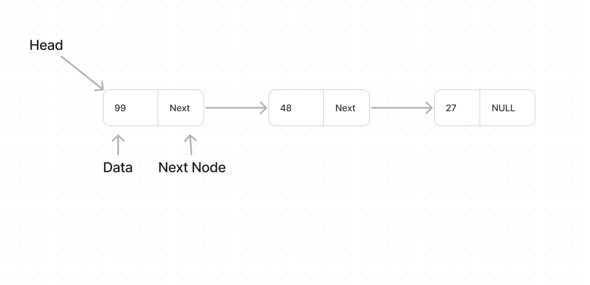

# Singly Linked List
#### Description
Creating a singly linked list with help of structure.

### Linked List Visual Example
here is how linked list looks like:



### Code Walkthrough and explaination
Nesseary imports for the C
```c
#include  <stdio.h>
#include  <stdlib.h>
```
To create a linked list first define a structure of it, so that with help of using it we will create Singly Linked List.
```c
 struct  Node
{
	int  data;
	struct  Node  *  next;
};
```
And struct named as Node and it requires two thing one is int of data and second is next node pointer as Node struct.

let's initialize our Linked List in our main function.
```c
int  main(){
	struct  Node  *  head;
	struct  Node  *  second;
	struct  Node  *  third;
	head  = (struct  Node  *)malloc(sizeof(struct  Node));
	second  = (struct  Node  *)malloc(sizeof(struct  Node));
	third  = (struct  Node  *)malloc(sizeof(struct  Node));
	
	head->data  =  8;
	head->next  =  second;
	
	second->data  =  66;
	second->next  =  third;

	third->data  =  24;
	third->next  =  NULL;
	
	return  0;
}
```
First we are initiallizing our veriables as a pointer with Structure of Node named as head, second and thrid.
After that allocate their memories in heap with help of malloc and the size of memory is sizeof struct Node.

after that we will initialize our data and point the next to the next Node; and last Node next should be NULL .
it's simple and we created the Singly Linked List in C.

let's create a traversal function and print the values of our list.
```c
void  linkListTraversal(struct  Node  *  ptr){
	while (ptr  !=  NULL)
	{
		printf("%d  \n", ptr->data);
		ptr  =  ptr->next;
	}
	return  1;
}
```
we are running our while loop till our ptr not becomes NULL and in while loop print the data of the pointer and assign `ptr = ptr->next` so it's goes to next Node and at the end ptr->next of the thrid (that is NULL) assign to ptr the ptr becomes null so while loop ends. Yep it's that much simple.

After the traversal our main function becomes.
```c
int  main(){
	struct  Node  *  head;
	struct  Node  *  second;
	struct  Node  *  third;
	head  = (struct  Node  *)malloc(sizeof(struct  Node));
	second  = (struct  Node  *)malloc(sizeof(struct  Node));
	third  = (struct  Node  *)malloc(sizeof(struct  Node));
	
	head->data  =  8;
	head->next  =  second;
	
	second->data  =  66;
	second->next  =  third;

	third->data  =  24;
	third->next  =  NULL;
	
	linkedListTraversal(head);
	
	return  0;
}
```
To traversal we only sending the head pointer to the function further Nodes it will automatically gets through Node->next. And that's it.