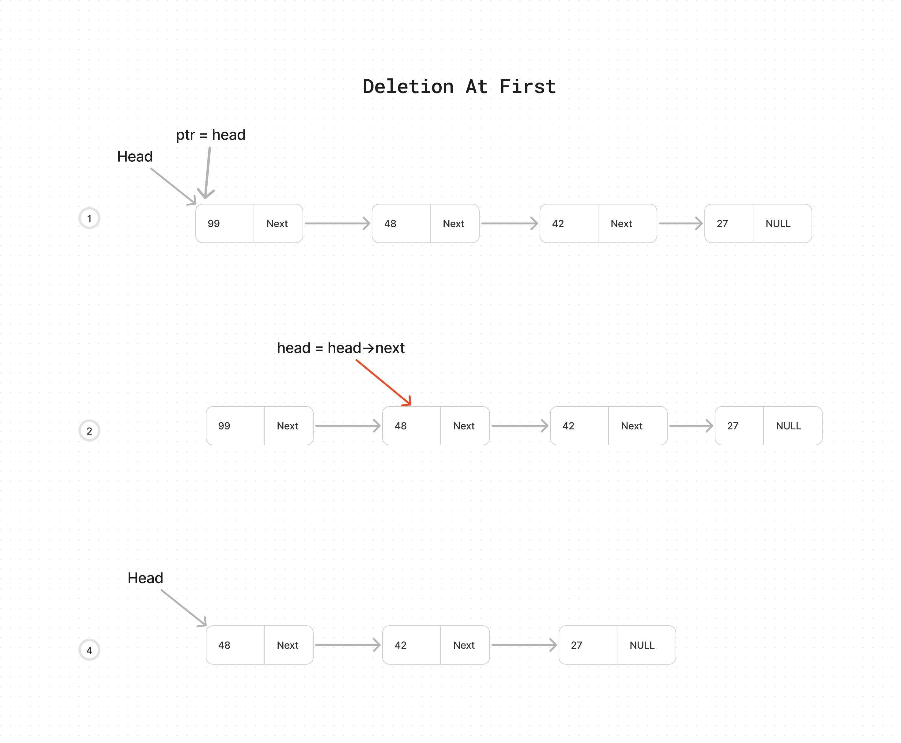
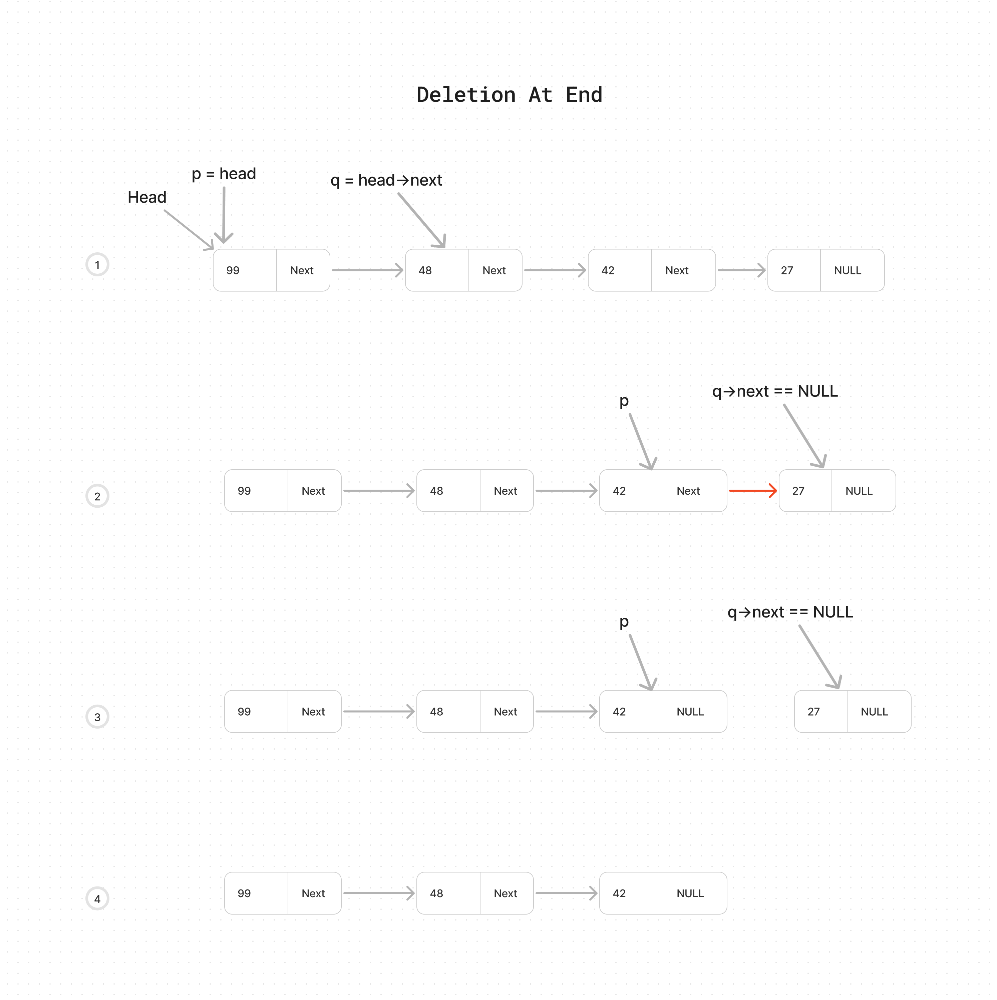
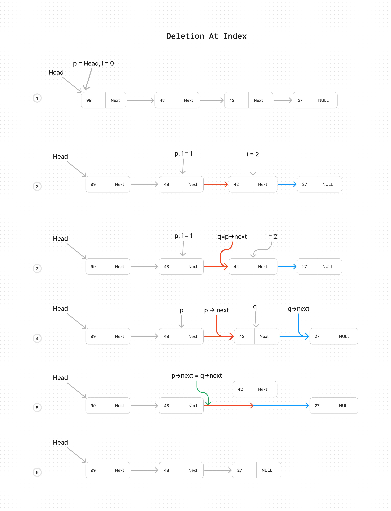
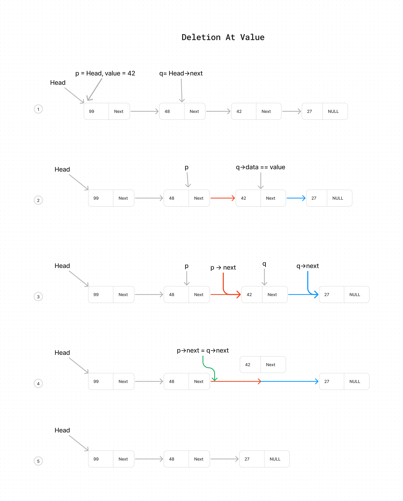

  

# Singly Linked List Deletion

  

#### Description

  

I am creating a function to delete an element in the singly linked list.

  

  

### Code Walkthrough and explaination

  

Necessary imports for the C

```c
#include  <stdio.h>
#include  <stdlib.h>
```

  

To create a linked list first define its structure, so that with the help of using it we will create a Singly Linked List.

```c
struct Node
{
	int data;
	struct Node * next;
};
```

  


The struct is named Node and it requires two things one is the int of data and the second is the next node pointer as Node struct.

  

Here is the traversal function we discussed in our SinglyLL readme file. You can get it further from there. But simply what it does is run a loop till the next of our Node does not become null and every time prints the data of the node.

```c
void  traversalLinkedList(struct Node * ptr){
	while (ptr != NULL)
	{
		printf("%d ", ptr->data);
		ptr = ptr->next;
	}	
	printf("\n");
	return  0;
}
```

  

Let's initialize our Linked List in our main function.

  

```c
int  main(){
	struct  Node * head;
	struct  Node * second;
	struct  Node * third;
	struct  Node * fourth;
	
	head = (struct  Node *)malloc(sizeof(struct  Node));
	second = (struct  Node *)malloc(sizeof(struct  Node));
	third = (struct  Node *)malloc(sizeof(struct  Node));
	fourth = (struct  Node *)malloc(sizeof(struct  Node));

	head->data = 99;
	head->next = second;
	
	second->data = 48;
	second->next = third;
	
	third->data = 42;
	third->next = fourth;
	
	fourth->data = 27;
	fourth->next = NULL;

	printf("Initial state of Linked List: \n");
	traversalLinkedList(head);

};
```

  

Now we are going to add Four types of deletion functions.

- [DeletionAtFirst](#Deletion-At-First)

- [DeletionAtEnd](#Deletion-At-End)

- [DeletionAtIndex](#Deletion-At-Index)

- [DeletionAtValue](#Deletion-At-Value)

  
  

---

  

### Deletion At First

Delete the Node at the first of our linked list.

**Approach**: The approach is simply that we are already getting the head so what we have to do is make the head equal to it's next.
  

**code**

```c
	struct  Node * deleteFirstNode(struct  Node * head){
		struct  Node * ptr = head;
		head = head->next;
		free(ptr);
		
		return  head;
}
```

What this function gets is head Node and creates a structure ptr equal to head. And then the head becomes equal to its own next. And because we freed the `ptr` free it also from a computer with the help of `free(ptr)` after free return the head.

here is visial example:

  

**Time Complexity**
Its time complex is O(1) because no loop at all and does not depend on the size of the list simply detach our first Node at the first of the List.

  
  

---

### Deletion At End

Delete the Node at the end of the linked list.

**Approach**: The approach to deleting the Node at the end is also a simple thing. First, to approach the last element we will run a loop till the End, we will run a loop till the next of it does not become Null. And loop stops one step before the Node that next is Null. So what we do is simply set that one step before Node equals to Null and from now on this Node becomes end Node.  

**code**

```c
struct  Node * deleteLastNode(struct  Node * head){
	struct  Node * p = head;
	struct  Node * q = head->next;
	while(q->next != NULL){
		q = q->next;
		p = p->next;
	}
	p->next = NULL;
	free(q);
	return  head;
}

```

In the `deleteLastNode` function firstly we created a new structure and named them as `p,q`, for `p` we set it equal to head so it's on the first element of the linked list. And for `q` we set it as equal to the next of the head so it's on the second element of the linked list.  So simply our `q` is ahead of `p` because through the help `q` we will be checking when it's next is quals to NULL. When the next of `q` becomes Null then now we know it's our last element so as our `q` was one step ahead of our `p` at this point our `p` is the second last element of the linked list. So what we have to do is simply make the next of `p` to be Null. And free the q.
and then returns the head.

  

**Time Complexity**

It's time complex is O(n) because it has a loop and if the list size increases then the loop cycle also increases.

  
A visual example is here:



  

---

### Deletion At Index

Delete the Node at a specified index in the linked list.

**Approach**: So the approach to delete a specific index is simple, we will get the index value and the linked list as a prop. First, we assign one structure pointer and then we start a loop from 0 to the index -1 because we want to stop one step before the index that we wanna delete. In that loop, we will set our pointer and set it to its next and also increase the i. When loops stop one step before the deletion index then we create another Node structure that is next to the last Node pointer that we were increasing in our loop. So now what happens is our second created Node is the Node we wanna delete. And first Node was one step before so yep you guessed it right, we set our First Node pointer next to equal to the Second Node pointer next. and then free the second node and return the head.


**code**

```c
struct  Node * deleteAtIndex(struct  Node * head, int  index){
	if(index == 0){
		head = deleteFirstNode(head);
		return  head;
	}
	struct  Node * p = head;
	int  i = 0;

	while (i != index -1 )
	{
		p = p->next;
		i++;
	}

	struct  Node * q = p->next;
	p->next = q->next;
	free(q);
	return  head;
}
```

In the `deleteAtIndex` function it requires head Node and index at which Node need to be deleted. After that, we create a new pointer Node named `p` and set it equal to the head and also initialize a variable I that we are going to use in the loop. Then start the loop and stop it one step before the index and in the loop make our `p` equal to the next of its own each time and increment the i. When the loop ends the `p` is one step before the index we want to delete. Then we initialize the new struct pointer named `q` and set it to next of the `p`. 
**( If you are thinking that at the start we can define two pointers one is `p` and the second is `q` with equal to next of head, and in the loop, we set it equal to its next. Yes, we can also do this but which one is shorthand and easy? And Yep Both will work fine )**.
 So the `q` is the Node we want to detach or wanna delete. So set the next of our `p` equal to the next of the `q`. Simply the next of `p` breaks from the `q` and attaches to the next of the `q`. In the end free the `free(q)` and return the head. 


  

**Time Complexity**

It's time complex is O(n) because it has a loop and the worst case is if we have to delete the element at the end indexes of the Linked List, and it's loop cycle increases depending on the index.

A Visual example is here:



  

---

### Deletion At Value


Delete the Node at a given Node value in the linked list.

**Approach**: The approach is kind of similar to the deletion at index, we will initialize our structure pointers variables p equals to our head and q equals to next of head and then we will start the loop and set them equal to their next till we don't find the Node that value matches with our parameter value. So the loop condition we will use is that if q->data is not equal to our value and if next of q q->next not equal to Null because then we are end and haven't found any matched Node then we also wanna stop the loop. Now if we have found a value and as our q is one step ahead of p it's on the Node that we wanna delete. So what we do is set the next of p equals to the next of q. You can also try this one by yourself!

**code**

```c
struct  Node * deleteAtValue(struct  Node * head, int  value){
	struct  Node * p = head;
	struct  Node * q = head->next;
	if(p->data == value){
		head = deleteFirstNode(head);
		return  head;
	}
	while (q->data != value && q->next != NULL)
	{
		q = q->next;
		p = p->next;
	}
	if(q->data == value){
		p->next = q->next;
		free(q);
	}
	return  head;
}
```

In `deleteAtValue` first I assigned the two structure pointers named `p` and `q`, one is equal to `head` and the second is equal to the next of head `head->next`. After that, I checked if the first Node value was equal to our required value then ran the function `deleteFirstNode(head)` and returned the head. But if the value is not equal then proceed further for the while loop and run the while loop till the data of q `q->data` not becomes equal to the value with an operation that if next of q does not equal to Null `q->next != Null` because if the next is Null that means we haven't found any value and list is ended. Loop exits if we find a value on q and if the next of `q` is `Null`. Then we check if the data of q equals our value `q->data == value` then we have found a value. If Found a value then as our `q` is the element we want to delete and `q` is one step ahead of `p`, we set our next of `p` (that was q) equal to the next of the `q`. And free the q `free(q)` and leave the if condition. And return head. But if we do not find any value then we will not change the head and return it as it is.

A Visual example is here:



**Time Complexity**
Its time complexity is O(n) because it has a loop and the worst case is if we have to delete the element at the end indexes of the Linked List, and its loop cycle increases depending on the index while searching for value.

---

  

### Use these functions in main function

```c
int  main(){
	struct  Node * head;
	struct  Node * second;
	struct  Node * third;
	struct  Node * fourth;

  
	head = (struct  Node *)malloc(sizeof(struct  Node));
	second = (struct  Node *)malloc(sizeof(struct  Node));
	third = (struct  Node *)malloc(sizeof(struct  Node));
	fourth = (struct  Node *)malloc(sizeof(struct  Node));

  

	head->data = 99;
	head->next = second;
	second->data = 48;
	second->next = third;
	third->data = 42;
	third->next = fourth;
	fourth->data = 27;
	fourth->next = NULL;

	printf("Initial state of Linked List: \n");
	traversalLinkedList(head);


	head = deleteFirstNode(head);
	printf("After deletion of first element \n");
	traversalLinkedList(head);
	
	// head = deleteAtIndex(head, 1);
	// printf("After deletion at Index \n");
	// traversalLinkedList(head);

  

	// head = deleteLastNode(head);
	// printf("After deletion at Last Node \n");
	// traversalLinkedList(head);

  

	// head = deleteAtValue(head, 48);
	// printf("After deletion at Value \n");
	// traversalLinkedList(head);
};
```
Now you can try every function by simply un-commenting it and verify the results through the visual pictures. Hope you enjoy learning about Deletion in Linked List, Follow More.
