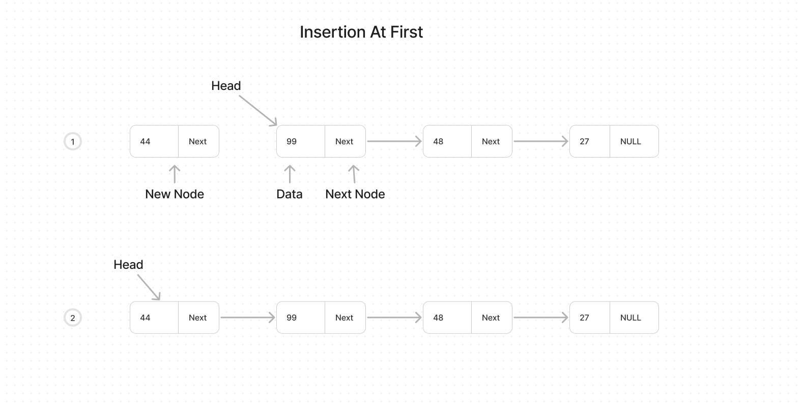
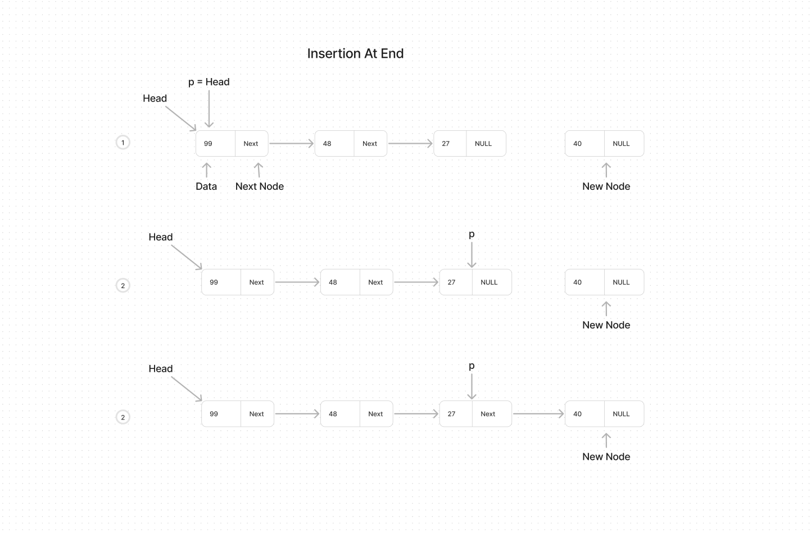
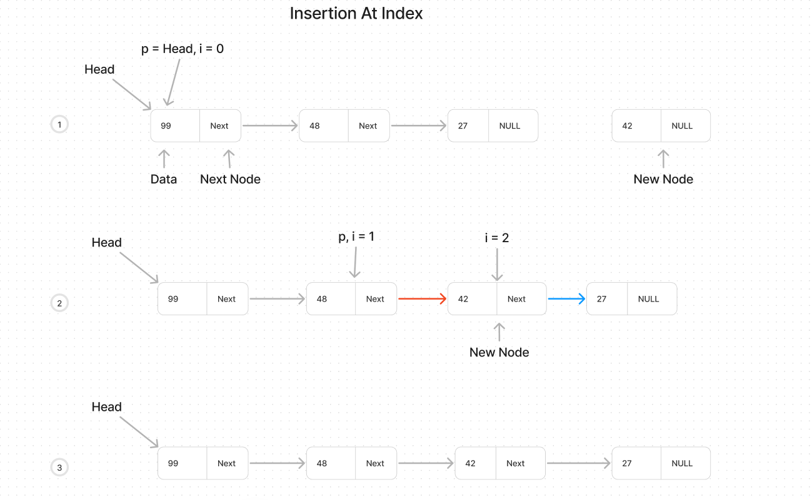

# Singly Linked List Insertion

#### Description

Creating a function to insert an element in singly linked list .

  

### Code Walkthrough and explaination

Necessary imports for the C
```c
#include  <stdio.h>
#include  <stdlib.h>
```

To create a linked list first define a structure of it, so that with help of using it we will create Singly Linked List.
```c

struct Node
{
	int data;
	struct Node * next;
};
```

And struct named as Node and it requires two thing one is int of data and second is next node pointer as Node struct.

Here is our traversal function we discussed the things in our SinglyLL readme file. you can get it further from there. But simply what it does is runs a loop till next of our Node not becomes null and every time print the data of the node.
```c
void  traversalLinkedList(struct  Node  *  ptr){
	while (ptr  !=  NULL)
	{
		printf("%d ", ptr->data);
		ptr  =  ptr->next;
	}
	printf("\n");
	return  0;
}
```
  

let's initialize our Linked List in our main function.

```c
int  main(){
	struct Node * head;
	struct Node * second;
	struct Node * third;

	head = (struct Node *)malloc(sizeof(struct Node));
	second = (struct Node *)malloc(sizeof(struct Node));
	third = (struct Node *)malloc(sizeof(struct Node));

	head->data = 8;
	head->next = second;
	
	second->data = 66;
	second->next = third;

  third->data = 24;
	third->next = NULL;
	
	printf("Initial state of Linked List: \n");
	traversalLinkedList(head);
	
	return  0;
}
```

Now we are going to add Four types of insertion functions.
- [InsertionAtFirst](#Insertion-At-First)
- [InsertionAtEnd](#Insertion-At-End)
- [InsertionAtIndex](#Insertion-At-Index)
- [InsertionAfterNode](#Insertion-After-Node)


---

### Insertion At First
Insert the new Node at the first of our linked list. 
**Approach**: The approach is simply just create a new Node that we want to insert and point our head start to our new node and the next of our new node to our exisisting list.

**code**
```c
struct  Node  *  insertAtFirst(struct  Node  *  head, int  data){
	struct  Node  *  ptr  = (struct  Node  *)malloc(sizeof(struct  Node));
	ptr->next  =  head;
	ptr->data  =  data;
	return  ptr;
}
```
what this function get is head Node and data to be inserted. After that we created a new Node and allocate it in memory named ptr, and simly what did is set the `ptr->next` equals to our head Node and set it's data, in final the new head is our ptr as we insert in First of Linked List. so return it.

**Time Complexity**
It's time complexit is O(1) because no loop at all and not depends on the size of the list simply we attach our new Node at the first of the List.


Visual example is here:



---
### Insertion At End
Insert the new Node at the end of the linked list.
**Approach**: The approach to add the new Node at the end is first we allocate our new Node, after that as we have to attach that node at the end of the list so we create a pointer, and set that pointer equals to our head, and we run our pointer till it's next not becomes NULL, as our pointer is at last and equal to our last element so that what we will do is set pointer next to our new created Node and set the data of our created Node, and set the next of our created Node to be Null. that it.

**code**
```c
struct  Node  *  insertAtEnd(struct  Node  *  head, int  data){
	struct  Node  *  ptr  = (struct  Node  *)malloc(sizeof(struct  Node));
	struct  Node  *  p  =  head;
	while(p->next  !=  NULL){
		p  =  p->next;
	}

	p->next  =  ptr;
	ptr->data  =  data;
	ptr->next  =  NULL;

	return  head;
}
```
Her in `insertAtEnd` function firstly we created a new Node and allocated it in memory and named as `ptr`, further we have created a pointer `p` Node and set it  equals to head. And after that runs a loop till the next of the pointer not becomes NULL, when next of pointer becomes NULL then loop stops and yes now the pointer is at the last element even if we print it's data it will be the data of the last element, so now set the pointer next equals to our new created Node and set new created Node data and as we inserted element in the end so no other node after that so set the next of our created Node to be NULL, and finally return the head. 

**Time Complexity**
It's time complexit is O(n) because it's have a loop and if the list size increases then loop cycle also increases.

Visual example is here:


---
### Insertion At Index
Insert the new Node the a specified index in linked list.
**Approach**: First we have to allocate our new Node then get one pointer that will walthrough till the required index -1, and initially assign a veriable i = 0 and increment it by 1 after each loop cycle. And stops the loop one step before where we have to insert, then set the data of our created Node and set  and next of our crated Node is next of our pointer node and the pointer next equals to our created Node.

**code**
```c
struct  Node  *  insertionAtIndex(struct  Node  *  head, int  data, int  index){
	struct  Node  *  ptr  = (struct  Node  *)malloc(sizeof(struct  Node));
	struct  Node  *  p  =  head;

	int  i  =  0;
	while(i  !=  index  -1){
		p  =  p->next;
		i++;
	}

	ptr->data  =  data;
	ptr->next  =  p->next;
	p->next  =  ptr;
	return  head;
}
```
In `insertAtIndex` function it requires head Node, data to be inserted and index at which new Node need to be inserted. After that we create a new Node and allocate a memory to it and named it as `ptr` further we have created a pointer Node called `p` and set it equals to head.  Now create a `int i = 0` and runs a loop till the required index -1 means stops one step befores the required index. then set the new created Node data and set the next of our created Node is equals to our pointer next and pointer next becomes equals to our created Node. at the end return the head.

**Time Complexity**
It's time complexit is O(n) because it's have a loop and worst case is if we have to insert the element at the end indexes of the Linked List, and it's loop cycle increases depending on index.


Visual example is here:


---
### Insertion After Node
Insert the new Node after a given Node in linked list.
**Approach**: For this one approach is quite simple we have given a previous Node only just we have to do is set the data of our created Node and set the next of our created node equal to the next of the previous Node and break the next of that Node and point it to our new created Node.

**code**
```c
struct  Node  *  insertAfterNode(struct  Node  *  head, struct  Node  *  prevNode, int  data){
	struct  Node  *  ptr  = (struct  Node  *)malloc(sizeof(struct  Node));
	ptr->data  =  data;

	ptr->next  =  prevNode->next;
	prevNode->next  =  ptr;
	return  head;
}
```

**Time Complexity**
It's time complexit is O(1) because the previous Node is already given only we have to set its data and it's next, so increase of size not effects the function.


In `insertAfterNode` function it requires head of our Linked List, further previous Node and data that need to be inserted. We create a new Node and allocate it in memory and named it as `ptr` then set the data of our created Node, then the next of our created Node becomes equals to next of our previous Node and next of our previousNode becomes equal to our created Node. Yep it's simple as that.

---

### Use these functions in main function
```c
int  main(){
	struct  Node  *  head;
	struct  Node  *  second;
	struct  Node  *  third;
 

	head  = (struct  Node  *)malloc(sizeof(struct  Node));
	second  = (struct  Node  *)malloc(sizeof(struct  Node));
	third  = (struct  Node  *)malloc(sizeof(struct  Node));

  
	head->data  =  88;
	head->next  =  second;
	
	second->data  =  48;
	second->next  =  third;

	third->data  =  27;
	third->next  =  NULL;

	printf("Initial state of Linked List: \n");
	traversalLinkedList(head);
	
	head  =  insertAtFirst(head, 44);
	printf("After insertion at first \n");
	traversalLinkedList(head);

	head  =  insertionAtIndex(head, 42, 2);
	printf("Insertion in b/w the index \n");
	traversalLinkedList(head);

  
	head  =  insertAtEnd(head,40);
	printf("After insertion at end \n");
	traversalLinkedList(head);
	
	head  =  insertAfterNode(head, third, 50);
	printf("Insertion after a Node \n");
	traversalLinkedList(head);

	return  0;

}
```

